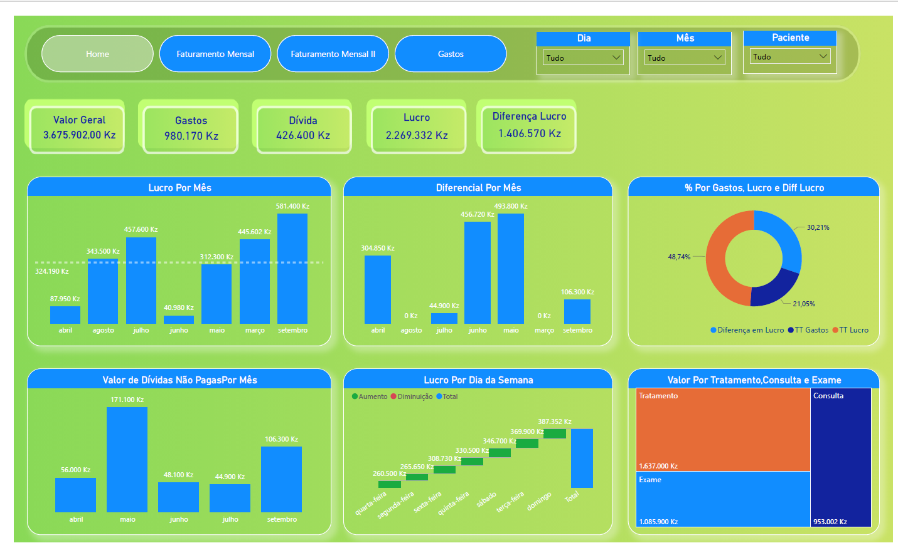
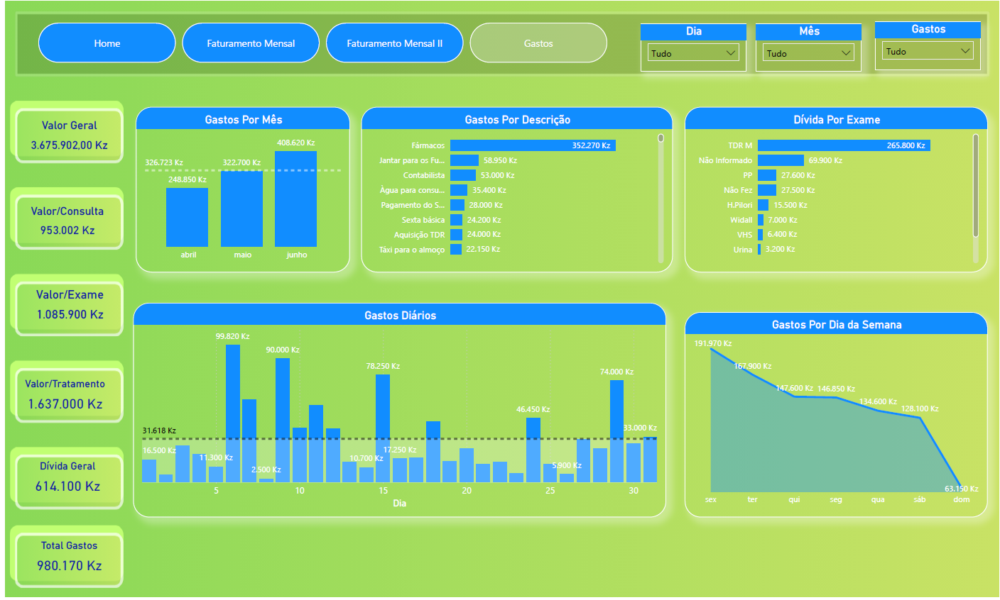

Saudações de acordo com o fuso horário.
Quero partilhar convosco a conclusão de um projeto de Análise de Dados aplicado a um Centro Médico, um trabalho que me permitiu transformar dados do dia a dia em informação útil para apoiar decisões de gestão.
Ao longo do projeto, analisei dados financeiros e operacionais com o objetivo de entender melhor o desempenho do centro médico, identificar padrões e responder a perguntas importantes do negócio, tais como:
 - Onde está a maior fonte de faturamento?
 - Quais serviços geram mais valor?
 - Como estão os custos e as dívidas?
 - Qual é a evolução mensal de pacientes?
📊 Principais análises realizadas:
Faturamento e lucro mensal
Faturamento por género
Desempenho por tipo de serviço (Consultas, Exames e Tratamentos)
Análise de dívidas (Pagas vs. Não Pagas)
Evolução do número de pacientes por mês
Análise detalhada de gastos (mensais, diários e por descrição)

KPIs Principais do Projeto:
-Receita Total
-Resultado Operacional
-Margem Operacional (%)
-Volume Mensal de Pacientes
-Custos Operacionais Totais
-Taxa de Inadimplência (%)
O resultado deste trabalho pode ser visto baixando o projeto, onde apresento uma visão clara e objetiva do desempenho financeiro e operacional do centro médico, destacando insights que podem apoiar ações estratégicas e melhorias no processo de gestão.
Este projeto reforçou ainda mais a importância de decisões baseadas em dados, especialmente na área da saúde, onde informação de qualidade faz toda a diferença.
Fico aberto a feedbacks, trocas de ideias e novas oportunidades na área de Análise de Dados.
# Dashboard do Projeto

